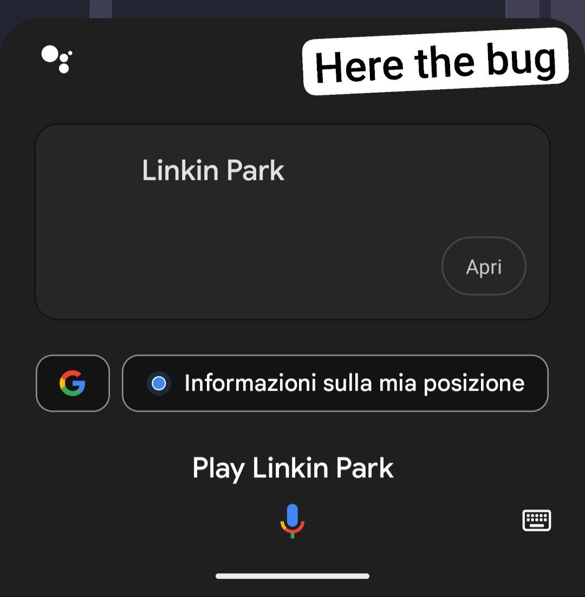

# Assistant Dismiss

When you ask Google Assistant to play music on YouTube Music ReVanced, the music starts but the Assistant overlay stays on screen:

<p align="center">
  
</p>

This happens because microG doesn't send the close signal back to Assistant after playback starts. This app auto-dismisses the overlay once music is playing.

## Requirements

A patched GmsCore is also needed. Without it, YouTube Music crashes when Assistant tries to connect to it (Dynamite modules load from the real GMS instead of microG).

## Install

1. Download [AssistantDismiss](https://github.com/daboynb/AssistantDismiss/releases) and [GmsCore](https://github.com/daboynb/GmsCore/releases)
2. Install both APKs
3. Enable Android's accessibility system:
```bash
adb shell settings put secure accessibility_enabled 1
```

4. Register the accessibility service:
```bash
adb shell settings put secure enabled_accessibility_services "app.revanced.android.gms.assistant/org.microg.gms.assistant.AssistantDismissService"
```

5. Grant permission to re-enable itself after reboot:
```bash
adb shell pm grant app.revanced.android.gms.assistant android.permission.WRITE_SECURE_SETTINGS
```
